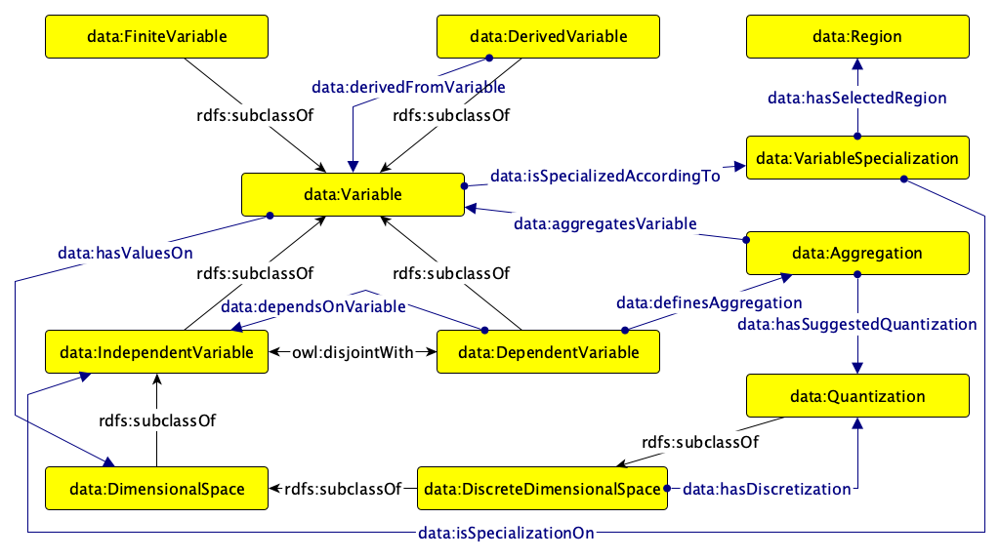

# VariableDimensionalSpace Ontology Design Pattern

## Description

The VariableDimensionalSpace ODP models the notion of a **variable**, intended as an abstraction that has meaning in the context of some relation to other variables and that can be associated with values in a well-defined **dimensional space**. The pattern distinguishes between variables that are independent and variables that depend on other variables, supports the representation of variables that are *aggregating* (i.e., defined through one or more aggregation functions without committing to a specific granularity), and allows variable derivation to be expressed through distinct, specializable relations (specialization, rescaling, componenthood). It further models dimensional spaces as either continuous or discrete, discrete spaces as possibly obtained through the discretization (sampling or binning) of a continuum, and singles out the special case of *finite* variables — corresponding to the notion of dataset — which can be linked to concrete data sources and formats.

|  |  |
| --- | --- |
|  Name: |  VariableDimensionalSpace |
|  Submitted by: | Miguel Ceriani [(miguel76)]([https://github.com/miguel76]) and Andrea Nuzzolese [(anuzzolese)]([https://github.com/anuzzolese]) |
|  Competency Questions: | Which is the dimensional space on which a variable takes values? Which variable(s) does a (dependent) variable depend on? Which variable is a specialization/rescaled version/component of another variable? Which aggregation(s) does a variable define, and over which variable is each aggregation performed? Which quantization is suggested for a given aggregation? Is a variable finite, i.e., does it correspond to a dataset? Which discrete dimensional space has been obtained by discretizing a given continuum, and through which quantization (sampling or binning)? What is the resolution, period, or offset of a given quantization? Which data source(s) and data format(s) serialize a given dataset? Which process generated or consumed a given dataset? |
|  Reusable OWL Building Block: | [VariableDimensionalSpace.ttl](VariableDimensionalSpace.ttl) |
|  Consequences: | Variables defined at different levels of genericity, dependency, and granularity — including datasets, aggregations, and their underlying discretizations — can be represented uniformly and related explicitly, enabling automatic reasoning over provenance, finiteness, and compatibility between variables. |
|  Scenarios: | The variable X is a specialization of the variable Y, constrained to a specific region of one of the variables it depends on ; The variable X is an aggregating variable that groups the values of variable Y by applying a function along a given dimension, with a suggested granularity ; The variable X depends on variables Y and Z, and is finite because Y and Z are both finite ; The dataset X is available at a data source through one or more data formats ; The discrete dimensional space X is obtained by regularly binning (or sampling) the continuum Y, optionally bounded to a specific region ; The dataset X was produced by a data generating process that consumed dataset Y as input. |

## Schema Diagram
The diagram follows the [Graffoo notation](https://essepuntato.it/graffoo/).

