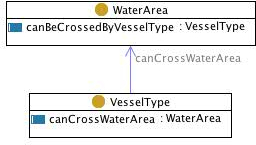

# 

 Graphical representation

__Diagram__ 

# 

 General description

|  |  |
| --- | --- |
|  Name:  |  VesselWaterArea  |
|  Submitted by:  | [AlessandroAdamou](../User/AlessandroAdamou.md "User:AlessandroAdamou")  |
|  Also Known As:  |  |
|  Intent:  |  to represent a direct relation between vessel types and water areas regardless of what type of fishing gear is fitted  |
|  Domains:  |  |
|  Competency Questions:  | <li>       which vessel types can be used in which water areas?      </li> |
|  Solution description:  |  ---  |
|  Reusable OWL Building Block:  | [http://www.ontologydesignpatterns.org/cp/owl/fsdas/vesselwaterarea.owl](http://ontologydesignpatterns.org/wiki/index.php?title=Special:ClickHandler&link=http://www.ontologydesignpatterns.org/cp/owl/fsdas/vesselwaterarea.owl&message=OWL building block&from_page_id=931&update=)  (636)  |
|  Consequences:  |  The pattern can be used to represent a water area setting and the vessels that can be used there, no matter whether these constraints are legal or logistic. The hasWaterArea object property is used as in the gearwaterarea pattern. Usage of this property as applied to VesselTypes is related to, but not strictly dependent on the hasWaterArea property as applied to GearTypes.  |
|  Scenarios:  |  in which water areas are 'gillneters' used?  |
|  Known Uses:  |  |
|  Web References:  |  |
|  Other References:  |  |
|  Examples (OWL files):  |  |
|  Extracted From:  |  |
|  Reengineered From:  |  |
|  Has Components:  |  |
|  Specialization Of:  |  |
|  Related CPs:  |  |

  

# 

 Elements

_The
 __VesselWaterArea__ 
 Content OP locally defines the following ontology elements:_ 

__VesselType__ 
 (owl:Class) Vessel types are conceptual entities.
 
 Mappable to fi:VesseltypeRef
 

_[VesselType](./GearVessel/usedByVesselType.md "Submissions:VesselWaterArea/VesselType") 
 page_ 

__WaterArea__ 
 (owl:Class) A physical water area. Mappable to fi:WaterAreaRef
 

_[WaterArea](../GearWaterArea/GearWaterArea.md "Submissions:VesselWaterArea/WaterArea") 
 page_ 

__canCrossWaterArea__ 
 (owl:ObjectProperty)
 

_[canCrossWaterArea](./VesselWaterArea/canCrossWaterArea.md "Submissions:VesselWaterArea/canCrossWaterArea") 
 page_ 

__canBeCrossedByVesselType__ 
 (owl:ObjectProperty) A physical water area. Mappable to fi:WaterAreaRef
 

_[canBeCrossedByVesselType](./VesselWaterArea/canBeCrossedByVesselType.md "Submissions:VesselWaterArea/canBeCrossedByVesselType") 
 page_ 

# 

 Additional information

 (type):
 [http://www.w3.org/2002/07/owl#Ontology](http://www.w3.org/2002/07/owl#Ontology "http://www.w3.org/2002/07/owl#Ontology") 

 (versionInfo): 1.1
 

 (imports):
 [http://www.ontologydesignpatterns.org/schemas/cpannotationschema.owl](http://www.ontologydesignpatterns.org/schemas/cpannotationschema.owl "http://www.ontologydesignpatterns.org/schemas/cpannotationschema.owl") 

 (versionInfo): Created by Alessandro Adamou
 

# 

 Scenarios

__Scenarios about VesselWaterArea__ 

 No scenario is added to this Content OP.
 

# 

 Reviews

__Reviews about VesselWaterArea__ 

|  Review article  | [Posted on](../Property/CreationDate.md "Property:CreationDate")  | [About revision (current is 9142)](../Property/ReviewAboutVersion.md "Property:ReviewAboutVersion")  |
| --- | --- | --- |
| [AldoGangemi about VesselWaterArea](../Reviews/AldoGangemi_about_VesselWaterArea.md "Reviews:AldoGangemi about VesselWaterArea")  |  2454908  17 March 2009  |  3687  3,687  |

 This revision (revision ID
 __9142__ 
 ) takes in account the reviews: none
 

 Other info at
 [evaluation tab](http://ontologydesignpatterns.org/wiki/index.php?title=Submissions:VesselWaterArea&action=evaluation "http://ontologydesignpatterns.org/wiki/index.php?title=Submissions:VesselWaterArea&action=evaluation") 

  

# 

 Modeling issues

__Modeling issues about VesselWaterArea__ 

 There is no Modeling issue related to this proposal.
 

  

# 

 References