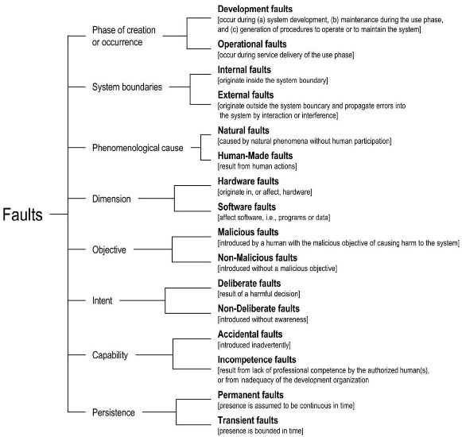
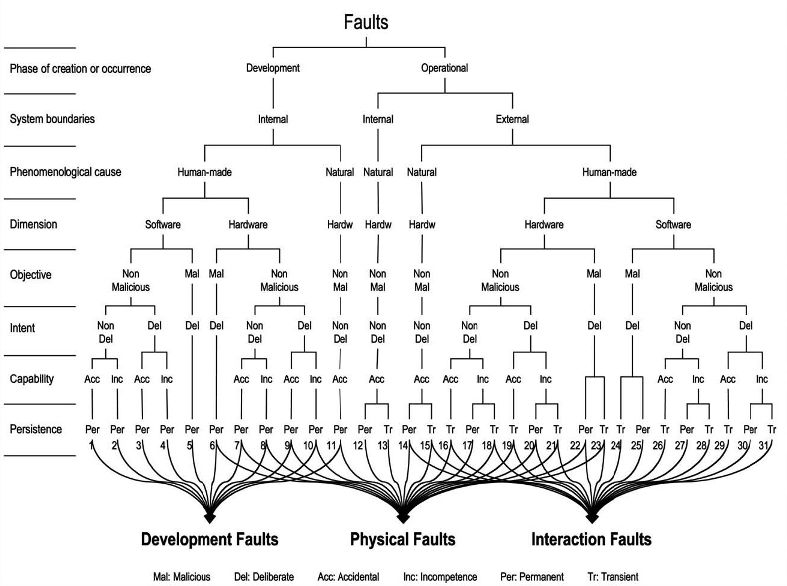

# 

 Graphical representation

__Diagram__ 

# 

 General information

|  |  |
| --- | --- |
|  Name  |  View Inheritance  |
|  Also known as  |  |
|  Author(s)  |  Benedicto Rodriguez-Castro, Hugh Glaser  |
|  Domain (if applicable)  | [General](../Community/General "Community:General")  |
|  Submitted by  | [BenedictoRodriguezCastro](../User/BenedictoRodriguezCastro "User:BenedictoRodriguezCastro")  , [HughGlaser](http://ontologydesignpatterns.org/wiki/index.php?title=User:HughGlaser&action=edit&redlink=1 "User:HughGlaser (not yet written)")  |

  

# 

 Description

|  |  |
| --- | --- |
|  Problem description  |  There are ontology domain concepts that are difficult to represent due to the complexities in their definition and the presence of multiple alternative criteria to classify their abstractions.  |
|  Solution description  |  Introduce the following types of classes: <li><i>        Criterion_i       </i>       : These classes represent each one of the alternative abstraction criteria of the TargetDomainConcept (       <i>        Criterion1       </i>       ,       <i>        Criterion2       </i>       ,       <i>        Criterion_i       </i>       in the Figure above). The list of classes may not be exhaustive or pairwise disjoint.      </li><li><i>        Ci_Class_x       </i>       : These classes refine each abstraction criteria class (       <i>        C1_Class1       </i>       , ...,       <i>        C2_Class1       </i>       , ...,       <i>        Ci_Class_i       </i>       in the Figure above). The list of classes may not be exhaustive or pairwise disjoint.      </li><li><i>        CiClass_xCjClass_y       </i>       ,       <i>        Ci_Class_xClass_y       </i>       : These classes participate in multiple inheritance relationships combining different refinements from the alternative abstraction criteria classes (       <i>        C1Class3_C2Class2       </i>       and       <i>        C1_Class1Class2       </i>       in the Figure above).      </li> |
|  Implementation workflow  |  |
|  Reusable component  |  |

  

# 

 Example

|  |  |
| --- | --- |
|  Problem example  |  |
|  Solution example  |  Figure above in particular, shows a matrix representation of all types of faults which may affect a system during its life. Implicitly, the figure reveals several alternative criteria for the classification of faults: <li>       A first criterion can be derived from the left column of the matrix (listing the basic view points from Figure 2:       <i>        Development/Operational Faults       </i>       ,       <i>        Internal/External Faults       </i>       and so on). This column represents the values of the eight basic viewpoints which lead to the elementary fault classes.      </li><li>       A second criterion can be abstracted from the bottom row (listing numbers 1 to 31). This row represents the 31 likely combinations of fault classes out of the 256 possible.      </li><li>       A third criterion is implicit at the top row, representing the three major partially overlapping groupings of faults:       <i>        Development       </i>       ,       <i>        Physical       </i>       and       <i>        Interaction       </i>       .      </li><li>       A fourth criterion can be seen at the bottom row, labeled       <i>        Examples       </i>       , containing nine illustrative examples of fault classes.      </li> |
|  Consequences  | __Inter- and Intra-criterion Multiple Inheritance.__  There is an interesting feature regarding the types of multiple inheritance relations that can take place in the context of a View Inheritance pattern. These types of multiple inheritance relationships can be characterized as: <li><b>        Inter-criterion       </b>       , when the parent classes involved in the multiple inheritance relation are subclasses of different abstraction criteria. The class       <i>        C1Class3_C2Class2       </i>       in Figure 1 is an example of this type of inheritance because one of its parent classes,       <i>        C1_Class3       </i>       , is a refining concept of       <i>        Criterion1       </i>       and the other parent class,       <i>        C2_Class2       </i>       , is a refining concept of       <i>        Criterion2       </i>       .      </li><li><b>        Intra-criterion       </b>       , when the parent classes involved in the multiple inheritance relation are subclasses of the same abstraction criterion. The class       <i>        C1_Class1Class2       </i>       is an example of this type of inheritance because all of its parents classes,       <i>        C1_Class1       </i>       and       <i>        C1_Class2       </i>       , are refining concepts of the same criterion,       <i>        Criterion1       </i>       .      </li><li><b>        Intra- and inter-criterion       </b>       , when there are at least two parents involved in the relation that are subclasses of the same abstraction criterion and there is at least one more different parent that is a subclass of a different abstraction criterion. An example of this type of inheritance is trivial to extrapolate from the composition of the previous two.      </li> |

  

# 

 Pattern reference

|  |  |
| --- | --- |
|  Origin  |  Object Oriented: <li>       Meyer, B.: Object-Oriented Software Construction (Book/CD-ROM) (2nd Edition). Prentice Hall PTR (March 2000)      </li> Ontology: <li>       Rector, A.L.: Modularisation of domain ontologies implemented in description logics and related formalisms including owl. In: K-CAP '03: Proceedings of the 2nd international conference on Knowledge capture, New York, NY, USA, ACM (2003) 121--128      </li> |
|  Known use  |  |
|  Reference  |  |
|  Related ODP  | [Submissions:Normalization](../Submissions/Normalization "Submissions:Normalization")  , [Submissions:Partition](../Submissions/Partition "Submissions:Partition")  , [Submissions:ClassAsPropertyValue](http://ontologydesignpatterns.org/wiki/index.php?title=Submissions:ClassAsPropertyValue&action=edit&redlink=1 "Submissions:ClassAsPropertyValue (not yet written)")  , [Submission:MultipleInheritance](http://ontologydesignpatterns.org/wiki/index.php?title=Submission:MultipleInheritance&action=edit&redlink=1 "Submission:MultipleInheritance (not yet written)")  |

# 

 Additional information

  

  

  

# 

 Scenarios

__Scenarios about View Inheritance__ 

 No scenario is added to this Content OP.
 

# 

 Reviews

__Reviews about View Inheritance__ 

 There is no review about this proposal.
This revision (revision ID
 __9979__ 
 ) takes in account the reviews: none
 

 Other info at
 [evaluation tab](http://ontologydesignpatterns.org/wiki/index.php?title=Submissions:View_Inheritance&action=evaluation "http://ontologydesignpatterns.org/wiki/index.php?title=Submissions:View_Inheritance&action=evaluation") 

  

# 

 Modeling issues

__Modeling issues about View Inheritance__ 

 There is no Modeling issue related to this proposal.
 

  

# 

 References