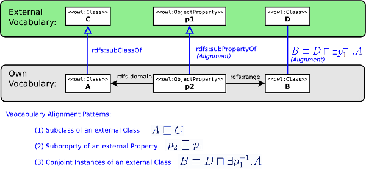

# 

 Graphical representation


__Diagram__ 


[](../../Image/Alignment-odp.png "Image:Alignment-odp.png")


# 

 General information


|  |  |
| --- | --- |
|  Name  |  Vocabulary Alignment Pattern: Conjoint Instances of an external Class  |
|  Also known as  |  |
|  Author(s)  |  ThomasRiechert  |
|  SubmittedBy  | [ThomasRiechert](../../User/ThomasRiechert "User:ThomasRiechert")  |


  


# 

 Description


|  |  |
| --- | --- |
|  Domain (if applicable)  | [General](http://ontologydesignpatterns.org/wiki/index.php?title=General&action=edit&redlink=1 "General (not yet written)")  |
|  Alignment problem addressed  |  Use of an already defined external concept and instances of this external concept.  |
|  Alignment solution  |  The patterns "Subclass of an external Class" and "Sub property of an external Property" allow the extension of external classes or properties. Instances, however, can not be easily instances of the external vocabularies.  But the use of instances of the external classes, is an essential aim of vocabulary alignments.So it should be possible, to use instances of the classes foaf:Agent or its subclass foaf:Person describe an instance of a class own:Person in the own ontology. The concepts foaf:Person and own:Person are notequivalent, but there is an intersection of instances. The set of intersection is even larger if the domain and range of properties of the own class are sub properties of properties of the external vocabulary.  As used herein, the description logic models a equivalence between class B and class D, for such instances of bothclasses, defined on an object property like p1.  The external class is from the perspective of their own domain typically in the rangeof an defined object property. Therefore, this pattern is used on an inverse object property.  |
|  Alignment workflow  |  |
|  Reusable component  |  |


  


```

 B owl:equivalentClass [ a owl:Class ; 
        owl:intersectionOf ( D
		[   a owl:Restriction ;
		    owl:onProperty [ owl:inverseOf p1 ]; 
		    owl:someValuesFrom A
		]
	)
     ].

 ].
 

```


  


# 

 Example


|  |  |
| --- | --- |
|  Problem example  |  |
|  Solution example  |  |
|  Consequences  |  |


  


# 

 Reference


|  |  |
| --- | --- |
|  Origin  |  |
|  Known use  |  |
|  Reference  |  |
|  Related to  |  |
|  Test  |  |


  


# 

 Scenarios


__Scenarios about Vocabulary Alignment Pattern: Conjoint Instances of an external Class__ 


 No scenario is added to this Content OP.
 


# 

 Reviews


__Reviews about Vocabulary Alignment Pattern: Conjoint Instances of an external Class__ 


 There is no review about this proposal.
This revision (revision ID
 __10915__ 
 ) takes in account the reviews: none
 


 Other info at
 [evaluation tab](http://ontologydesignpatterns.org/wiki/index.php?title=Submissions:Vocabulary_Alignment_Pattern:_Conjoint_Instances_of_an_external_Class&action=evaluation "http://ontologydesignpatterns.org/wiki/index.php?title=Submissions:Vocabulary_Alignment_Pattern:_Conjoint_Instances_of_an_external_Class&action=evaluation") 


  


# 

 Modeling issues


__Modeling issues about Vocabulary Alignment Pattern: Conjoint Instances of an external Class__ 


 There is no Modeling issue related to this proposal.
 


  


# 

 References